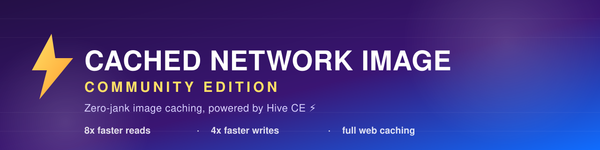
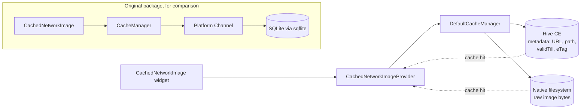

<p align="center">
  
</p>

<p align="center">
  <a href="https://pub.dev/packages/cached_network_image_ce"></a>
  <a href="https://fluttergems.dev/packages/cached_network_image_ce/"></a>
  <a href="https://github.com/Erengun/flutter_cached_network_image_ce/actions/workflows/ci.yaml"></a>
  <a href="https://opensource.org/licenses/MIT"></a>
  <a href="https://github.com/Erengun/flutter_cached_network_image_ce/stargazers"></a>
  <a href="https://github.com/sponsors/Erengun"></a>
</p>

<p align="center">
  
  
  
</p>

<h1 align="center">Zero-jank image caching for Flutter</h1>

<p align="center">
  <b>cached_network_image_ce</b> is the actively maintained fork of
  <a href="https://pub.dev/packages/cached_network_image"><code>cached_network_image</code></a>,
  rebuilt around a caching engine that doesn't block your UI thread. Same widget and provider API you already use.
</p>

---

## Table of contents

- [Why this fork exists](#why-this-fork-exists)
- [How we stack up](#how-we-stack-up)
- [Architecture](#architecture)
- [Benchmarks](#benchmarks)
- [Used by](#used-by)
- [Features](#features)
- [Quick start](#quick-start)
- [Full docs and advanced usage](#full-docs-and-advanced-usage)
- [FAQ](#faq)
- [Contributing](#contributing)
- [License](#license)

## Why this fork exists

`cached_network_image` by Baseflow is one of the most widely used packages in the Flutter ecosystem. It has also been effectively unmaintained since August 2024, sitting on 300+ open issues, including memory leaks and scroll-performance bugs that never got fixed.

Under the hood it leans on `sqflite` for cache metadata: a full SQL engine routed through a platform channel just to answer "have I already downloaded this image?" On image-heavy lists, that overhead shows up as jank you can feel.

We didn't fork this just to merge dependabot PRs. We rebuilt the caching layer.

We swapped `sqflite` for [`hive_ce`](https://pub.dev/packages/hive_ce), a pure-Dart, non-blocking key-value store. It skips the platform channel round trip and the SQL parser entirely, so there's no jank left to fix.

## How we stack up

vs. the original `cached_network_image`:

| | Original (`cached_network_image`) | This fork (`cached_network_image_ce`) |
|---|:---:|:---:|
| Cache backend | sqflite (platform channel) | ✅ hive_ce (pure Dart) |
| Maintenance | ❌ stale since Aug 2024 | ✅ active, regular releases |
| Web caching | ⚠️ browser cache only | ✅ full persistent IndexedDB cache |
| HTTP / cache interceptors | ❌ | ✅ full chains (auth, logging, custom responses) |
| Cache eviction | ❌ fixed | ✅ pluggable — TTL or LRU |
| Cache read (10 KB) | 16 ms | ✅ **2 ms — 8x faster** |
| Unsupported formats (SVG/AVIF/HEIC) | ❌ opaque decode error | ✅ `unsupportedImageBuilder` hook |

vs. other popular alternatives, checked live against pub.dev, so this is current rather than a guess:

| Package | Cache backend | Web support | Interceptors | Cleanup strategy | Maintenance |
|---|---|:---:|:---:|:---:|:---:|
| **cached_network_image_ce** (this) | hive_ce | ✅ full IndexedDB | ✅ HTTP + cache | ✅ TTL / LRU | ✅ active |
| `cached_network_image` | sqflite | ⚠️ browser only | ❌ | ❌ fixed | ❌ stale |
| `flutter_cache_manager` | sqflite / plain JSON | ✅ | ❌ | ❌ fixed | ✅ active |
| `extended_image` | undisclosed | ✅ | ⚠️ headers/retry only | ⚠️ manual clear | ✅ active |
| `fast_cached_network_image` | hive (plain) | ✅ (claimed) | ❌ | ⚠️ TTL only | ⚠️ stale (17mo) |

Worth saying plainly: `flutter_cache_manager` and `extended_image` are both actively maintained by reputable teams. They're solving different problems than we are: a generic file cache, and a broad image/gesture toolkit, respectively. The "actively maintained fork" pitch applies specifically against the original `cached_network_image`, which this package is a drop-in replacement for.

## Architecture



* **Old way:** Dart → platform channel → native SQLite → disk. Slow, blocking.
* **New way:** Dart → Hive CE (pure Dart, non-blocking) → disk. Instant.

That difference is what gets you zero-jank scrolling, even in image-dense lists.

## 🚀 Benchmarks

Measured cache metadata operations (check, write, delete) on an iPhone Simulator:

| Operation | Payload | Original (`sqflite`) | CE (`hive_ce`) | Improvement |
|---|---|---|---|---|
| **Read (Hit Check)** | 10 KB | 16 ms | **2 ms** | 8.00x faster |
| **Write (New Image)** | 10 KB | 116 ms | **29 ms** | 4.00x faster |
| **Delete (Cleanup)** | 10 KB | 55 ms | **19 ms** | 2.89x faster |
| **Read (Large)** | 1 MB | 8 ms | **1 ms** | 8.00x faster |

"Read" matters most for scroll performance, since every list item checks the cache before rendering.

<p align="center">
  
</p>

## Used by

Real apps shipping with `cached_network_image_ce`, found via a live GitHub code search for `pubspec.yaml` files that depend on it, sorted by stars:

| Project | Stars | What it is |
|---|---|---|
| [Kazumi](https://github.com/Predidit/Kazumi) |  | Rule-based anime scraper and streaming app with danmaku and real-time super-resolution. |
| [PiliPlus](https://github.com/bggRGjQaUbCoE/PiliPlus) |  | Third-party Bilibili client built with Flutter. |
| [plezy](https://github.com/edde746/plezy) |  | Cross-platform Plex and Jellyfin client. |
| [conduit](https://github.com/cogwheel0/conduit) |  | Native iOS/Android client for Open WebUI, OpenAI-compatible APIs, Ollama, and OpenRouter. |
| [haka_comic](https://github.com/raoxwup/haka_comic) |  | Third-party, ad-free client for the PicACG (Bika/Pica) comics platform. |
| [MusicPod](https://github.com/ubuntu-flutter-community/musicpod) |  | Music, radio, TV, and podcast player for Ubuntu and macOS. |
| [Fluxer](https://github.com/fluxerapp/flutter_client) |  | Official mobile client for Fluxer. |
| [jd_mall_flutter](https://github.com/GuoguoDad/jd_mall_flutter) |  | Flutter clone of a major Chinese e-commerce marketplace app. |
| [BoxBox](https://github.com/BrightDV/BoxBox) |  | Unofficial Formula 1 and Formula E companion app. |

Shipping something with it? [Open a PR](https://github.com/Erengun/flutter_cached_network_image_ce/pulls) and add yours, or check the [full, current list](https://github.com/search?q=cached_network_image_ce+filename%3Apubspec.yaml&type=code) yourself.

## Features

- **Drop-in replacement** — 99% API compatible with the original package.
- **hive_ce powered** — instant, non-blocking cache lookups.
- **Real web support** — persistent IndexedDB caching, not just browser HTTP cache.
- **HTTP & cache interceptors** — inject auth headers, logging, or synthetic responses without forking anything.
- **Pluggable eviction** — TTL (default) or LRU cleanup strategies.
- **Graceful unsupported-format handling** — SVG/AVIF/HEIC decode failures route to `unsupportedImageBuilder` instead of a bare exception.
- **Actively maintained** — regular releases, community-driven roadmap.

## Quick start

```sh
flutter pub add cached_network_image_ce
```

```dart
import 'package:cached_network_image_ce/cached_network_image.dart';

CachedNetworkImage(
  imageUrl: 'https://example.com/image.jpg',
  placeholder: (context, url) => const CircularProgressIndicator(),
  errorWidget: (context, url, error) => const Icon(Icons.error),
)
```

## Full docs and advanced usage

The quick start above covers the basics. For interceptors, cleanup strategies, connection timeouts, custom cache and metadata directories, web render modes, and unsupported-format handling, see the full reference:

[`cached_network_image/README.md`](cached_network_image/README.md)

## FAQ

**Q: Will I lose my users' existing cache if I migrate?**
A: Yes. Because we switched the storage engine from SQLite to Hive, the old cache files will be ignored. Users will re-download images once as they browse. This is a one-time migration cost for a permanent performance gain.

**Q: My app crashes/pauses on errors?**
A: In Debug mode, Flutter may pause on exceptions even if they are caught. This is expected behavior for network errors (404s). In Release mode, these are handled silently by the `errorWidget`.

**Q: Why is web caching slower, or why does it use Hive for image bytes?**
A: On Mobile & Desktop (IO), this package stores image bytes directly on the native file system and uses Hive *only* for metadata. Web lacks a native file system, so `hive_ce` stores both metadata and image bytes in IndexedDB there. Serializing large byte arrays in and out of IndexedDB carries overhead that doesn't exist on IO.
*Alternative:* if persistent caching across sessions isn't critical for your web users, consider conditionally using `Image.network` on web, which relies on the browser's built-in caching.

## Contributing

We welcome contributions! If you want to help maintain this package, check [CONTRIBUTING.md](CONTRIBUTING.md).

## License

MIT. See [LICENSE](LICENSE) for details.
